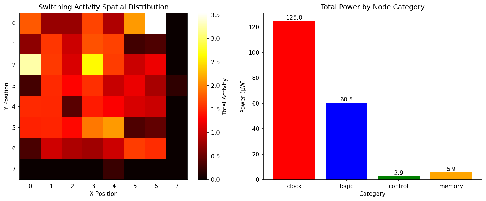

# big_data

> Sketch data structures and GPU experiments for EDA

A collection of self-contained experiments on **probabilistic streaming data
structures** (Count-Min Sketch, HyperLogLog), their **GPU-accelerated**
variants, and their application to **switching-activity / power analysis** in
electronic design automation (EDA).

Each experiment is a standalone module inside the `big_data` package and can be
executed directly with `python -m big_data.<module>`.

## Installation

```bash
pip install -e .
```

Runtime dependencies: `numpy`, `matplotlib`, `numba` (CUDA GPU required only for
the `*_gpu_demo` and `mandelbrot` modules).

## Modules

| Module | Description |
| --- | --- |
| `big_data.basic_count_min_sketch` | Count-Min Sketch for switching-activity tracking |
| `big_data.memory_accuracy_tradeoff_demo` | Memory usage vs. accuracy trade-off of Count-Min Sketch |
| `big_data.pattern_dependent_analyzer_demo` | Pattern-dependent and multi-corner switching analysis |
| `big_data.temporal_switching_analyzer_demo` | Temporal switching activity and current-envelope estimation |
| `big_data.switching_analysis_demo` | End-to-end switching power analysis (runs all demos) |
| `big_data.hyper_loglog_demo` | HyperLogLog cardinality estimation |
| `big_data.hyper_loglog_eda_demo` | HyperLogLog applications in EDA workflows |
| `big_data.hyper_loglog_gpu_demo` | GPU-accelerated HyperLogLog (Numba CUDA) |
| `big_data.simple_gpu_demo` | Minimal GPU HyperLogLog kernel |
| `big_data.better_gpu_demo` | Tuned GPU HyperLogLog with bias correction |
| `big_data.mandelbrot` | Interactive GPU Mandelbrot renderer |

## Usage

Run an individual experiment:

```bash
python -m big_data.switching_analysis_demo
```

Use the sketch implementations programmatically:

```python
from big_data.basic_count_min_sketch import CountMinSketch

cms = CountMinSketch(width=1000, depth=5)
cms.update(42, 1.0)
cms.update(42, 1.0)
print(cms.query(42))  # ~2.0 (never underestimates)
```

Generated figures are written to the working directory by the demo modules.

## Notebooks

Jupyter versions of several experiments live in [`notebooks/`](notebooks/).

## Figures



## License

MIT -- see [LICENSE.txt](LICENSE.txt).
